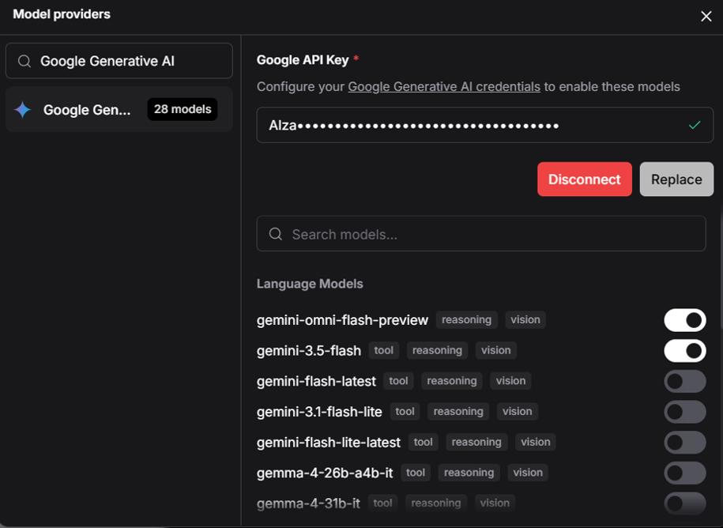
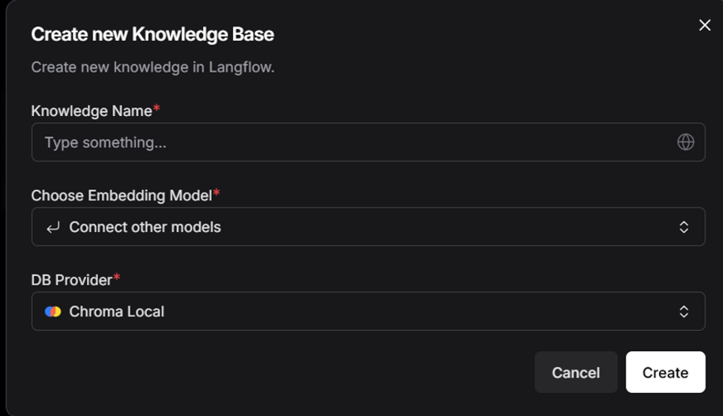
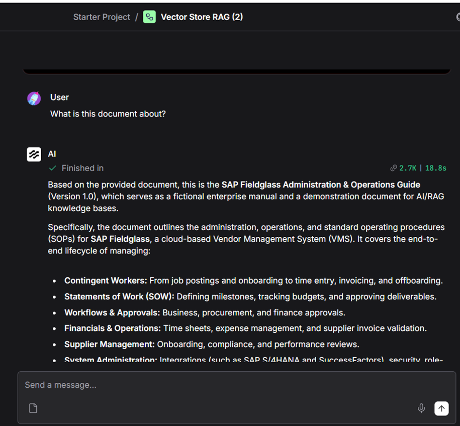
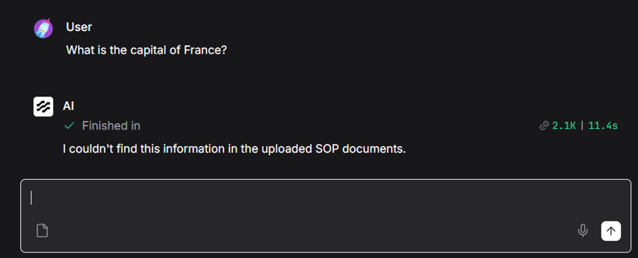

# Enterprise SOP Chatbot (RAG-Based AI Assistant)

## Overview

The Enterprise SOP Chatbot is an AI-powered assistant designed to help employees quickly access information from Standard Operating Procedures (SOPs), HR policies, procurement guidelines, finance documents, and other enterprise knowledge sources.

This project demonstrates the complete product development lifecycle—from product ideation and wireframing in Figma to designing a Retrieval-Augmented Generation (RAG) architecture and implementing an AI-powered enterprise chatbot.

The solution uses Retrieval-Augmented Generation (RAG) to retrieve relevant document content before generating responses, ensuring accurate and context-aware answers with source references.

📄 **Product Wireframes (Figma):** [Enterprise_SOP_Chatbot_Wireframes.pdf](Enterprise_SOP_Chatbot_Wireframes.pdf)
Login Screen.png

# 📸 Project Highlights

## Complete RAG Workflow

---

## Gemini Configuration

---

## Knowledge Base Creation

---

## Chatbot Test

---

## RAG Validation

